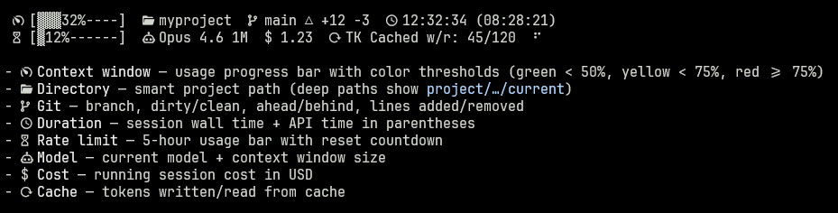

# Crystools-StatusLine

Claude Code plugin with productivity tools: status line, utilities, and workflow enhancements.


## Install

```bash
claude plugin marketplace add crystian/mia-marketplace
claude plugin install crystools-statusline@mia-marketplace
```

Then inside Claude Code, run `/crystools-statusline` to set up the status line.

### Status Line Preview

Supports three icon modes: **nerd**, **emoji** (default), and **none** (plain text).


### Help

There are these monitors (use `help` after the command to see it):



### Permissions

During setup, Claude Code will ask for permission to:

- **Read** `~/.claude/settings.json` — to check if the status line is already configured
- **Edit** `~/.claude/settings.json` — to add the `statusLine` and `CRYSTOOLS_SL_ICONS` configuration
- **Bash (find)** — to locate the [`statusline-command.sh`](./scripts/statusline-command.sh) script in the plugin installation directory

## Platform Support

| Platform | Status |
|----------|--------|
| **Linux** | Supported |
| **macOS** | Supported |
| **WSL** | Supported (developed on WSL) |
| **Windows (CMD/PowerShell)** | Not supported |

## Requirements

### jq

The status line script requires [jq](https://jqlang.github.io/jq/) to parse JSON input.

| Platform | Command |
|----------|---------|
| **macOS** | `brew install jq` |
| **Linux / WSL** | `sudo apt install jq` |

### git

Required for branch, status, and ahead/behind info.

## Nerd Font

Install some Nerd Font from the [Nerd Font](https://www.nerdfonts.com/) on your system, and configure your terminal to use it. The status line will automatically use the appropriate icons when `CRYSTOOLS_SL_ICONS` is set to `nerd`.

## License

MIT

---

Made with <3 by [Crystian](https://github.com/crystian)
